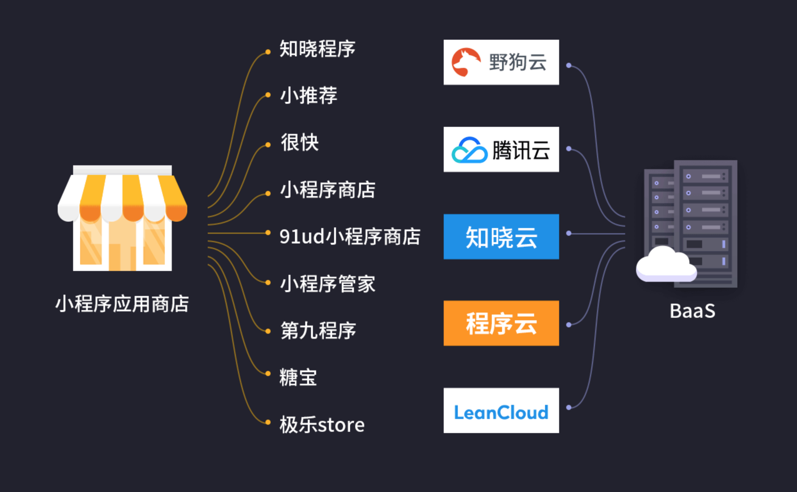
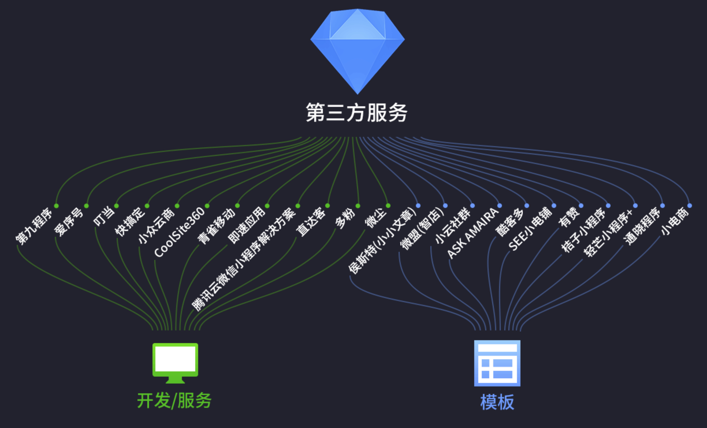
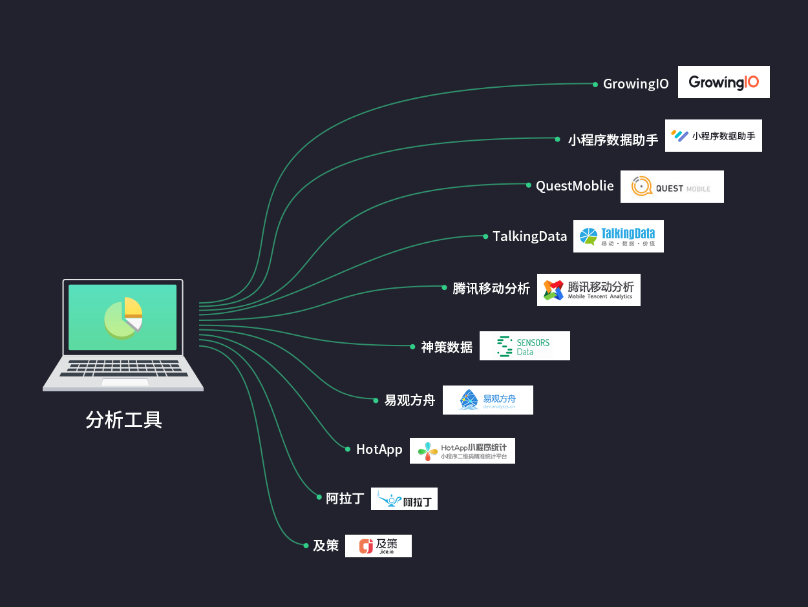
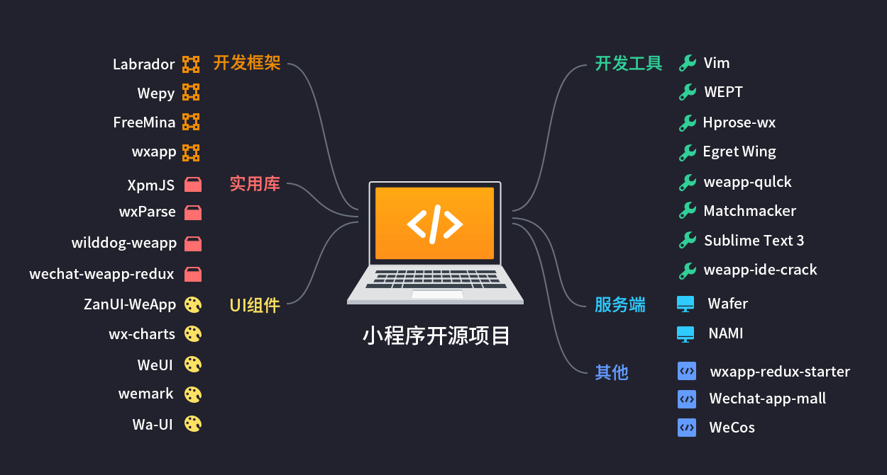
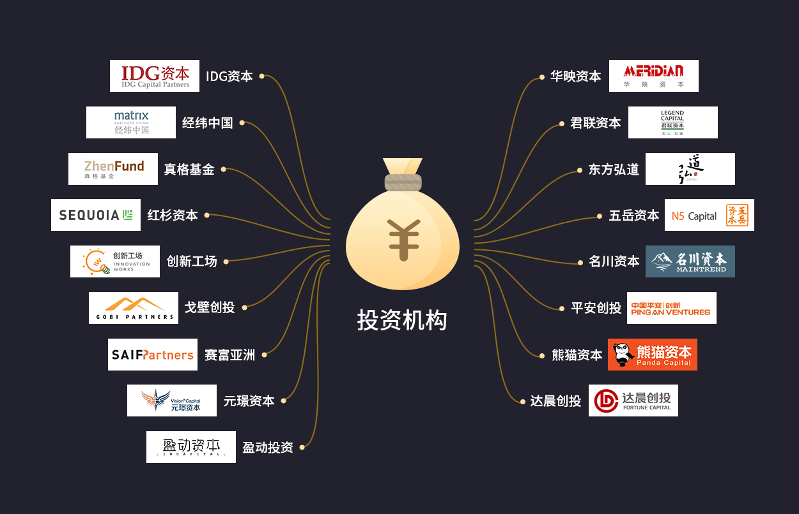
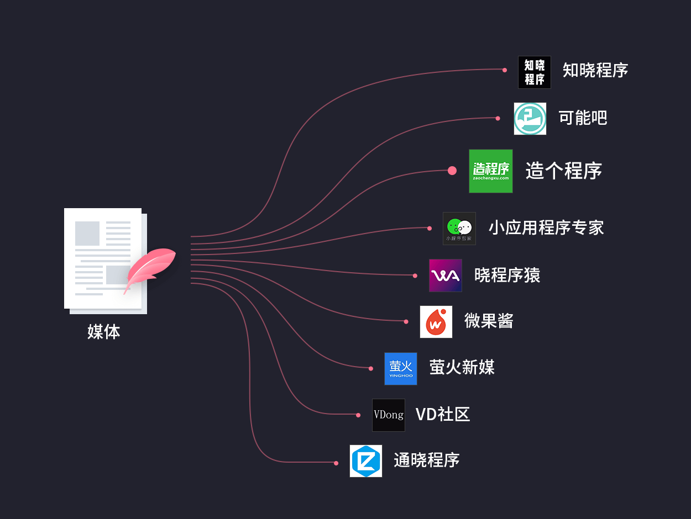
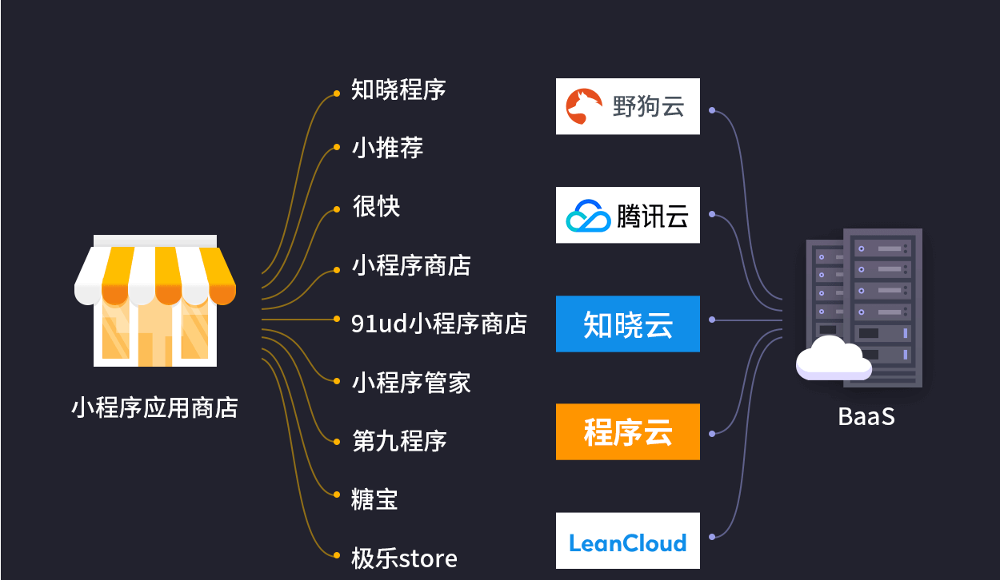
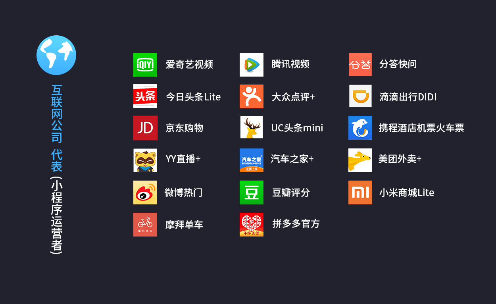
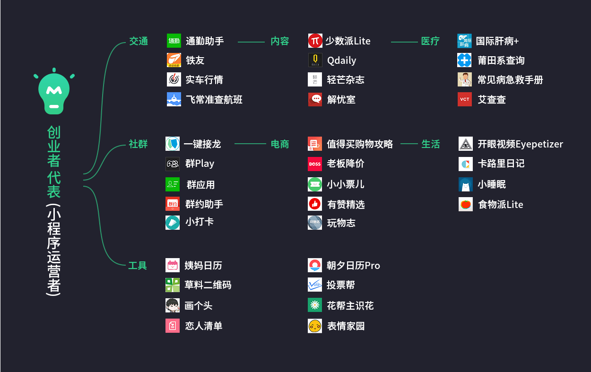
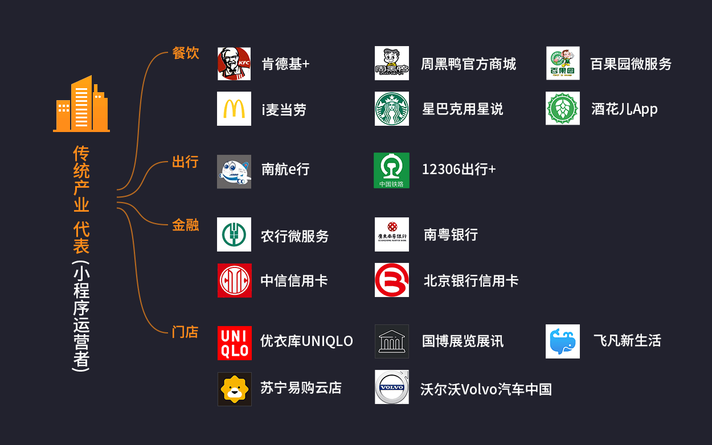

## 小程序生态产业云图

### BaaS
随着小程序生态圈的繁荣，BaaS服务受到了人们的重视，但目前可选择的服务相对有限。除了像LeanCloud、腾讯云这种成熟的云服务公司外，也催生了一部分创业项目，例如野狗云、程序云、知晓云等。

### 第三方服务

我们把第三方服务分为：「开发／服务」和「模版」。

**开发／服务**

这一分类中，第三方厂商扮演着一个外包服务商的角色，他们为那些希望拥有小程序的人／厂商提供定制化的开发服务，同时也提供种类繁多的小程序模版。这一市场的佼佼者包括：「即速应用」、「微尘」、「快搞定」、「CoolSite360」，以及官方的「腾讯云微信小程序解决方案」。

**模板**

4月17日，微信官方宣布，第三方平台支持小程序。第三方平台的介入降低了小程序的开发门槛，这一举措无疑对小程序生态的繁荣起到至关重要的作用。

除了上述第三方服务商外，也有些厂商向公众提供单一类别的小程序模版，小程序运营者只要授权给第三方即可迅速生成一个与该模版类似的小程序。这些模版往往已经拥有某些类别的小程序，在设计和功能上也更为出色，尤其是电商类和资讯类。代表厂商包括：「小小文章」、「SEE小店铺」、「有赞商城」「轻芒小程序+」等。

### 分析工具

与PC互联网时代的流量统计、广告联盟，以及移动互联网时代的流量统计和APM平台类似，这类工具可以对小程序进行全面的检测。例如：阿拉丁、GrowingIO、HotApp、TalkingData等。

微信官方的统计工具「小程序数据助手」具有明显优势——原生自带、无需内嵌代码、体验较好，已经能够满足小程序运营者的日常需求。未来，第三方统计分析平台会向各个细分的领域的延伸，提供更丰富的场景及外延服务，形成百花齐放的态势。

### 开源项目

目前，有很多优秀的开发者，将项目组件进行开源，使得开发者无需重复开发基础组件。这与PC／移动互联网的开源生态类似，开源极大地推动了行业的发展。开源项目的数量，也在一定程度上反映了生态的成熟度。我们观察到的开源项目，大致有以下几类：

- UI组件
- 服务器
- 开发框架
- 实用库
- 开发工具
- 其他

### 资本机构

### 媒体

### 小程序应用商店

应用商店是小程序生态中竞争较为激烈的一个市场，目前做的较大的应用商店已不下于十家。除了入局较早的「知晓程序」外，还包括「小推荐」、「第九程序」、「小程序管家」、「91ud小程序商店」等。

### 小程序运营者

这类公司中，大多是已在App上相对成功的厂商，尤其是在移动互联网掘到金的互联网新贵，例如「滴滴出行」、「今日头条」、「摩拜单车」、「大众点评」等。由于小程序生态毕竟无法与原声应用相比，此类公司在小程序上大多只展现核心业务。由于有一定的用户基础，这类公司在小程序生态的起点也相对较高。

### 创业者

### 传统行业

