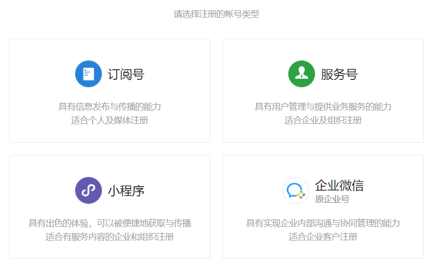
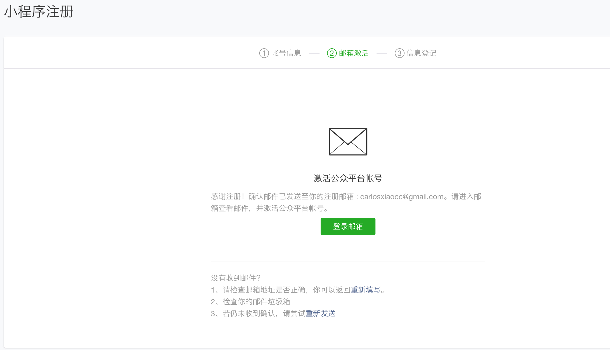
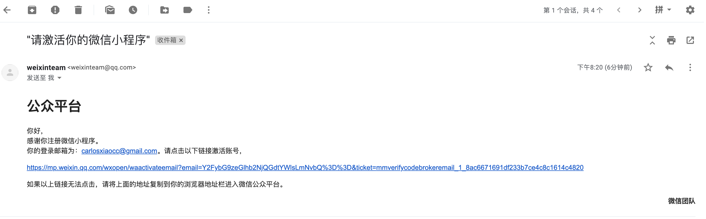
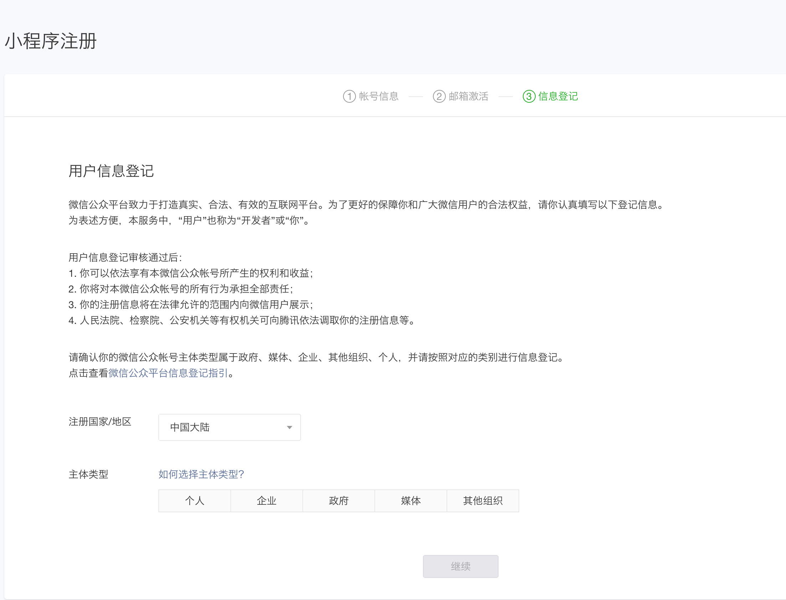
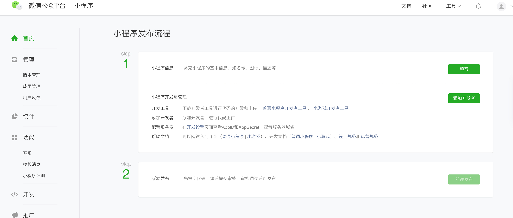

## 准备工作

### 注册小程序账号

1. 注册小程序账号

   > 进入[微信公众平台](https://mp.weixin.qq.com/), 点击立即注册；然后选择小程序账号申请
   >
   > 
   >
   > **邮箱注意事项：邮箱不能是微信公众平台，开发平台注册过的邮箱，也不能是个人微信号绑定的邮箱**
   >
   > 

2. 激活邮箱

   

   进入邮箱激活

   

3. 信息登记

   主体类型选择个人。

   

4. 登录小程序管理后台

   

5. 完善小程序信息

   

### 安装微信开发工具

[微信开发工具](https://developers.weixin.qq.com/miniprogram/dev/devtools/download.html)

