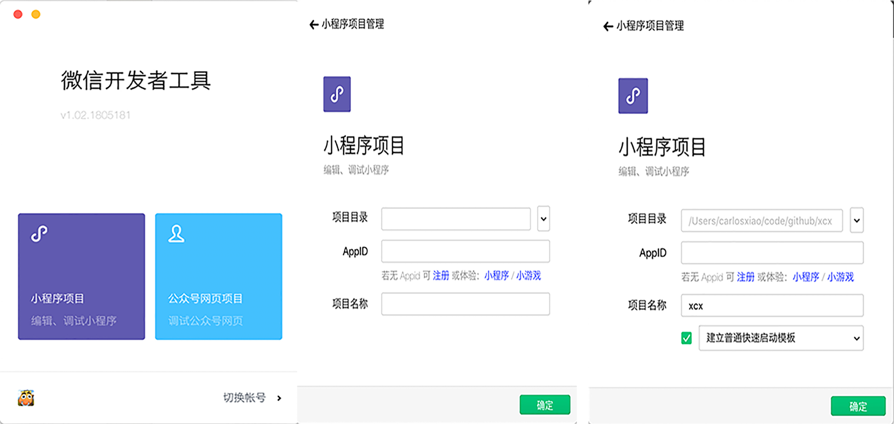
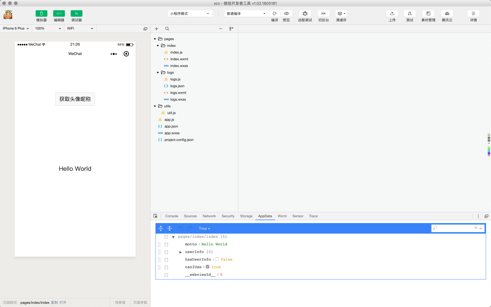

## 第一个小程序

### 新建项目

**打开微信开发工具，扫码登录选择小程序项目**

**项目目录如果为空的话，会出现快速启动模板来快速在本地创建一个微信小程序项目 **

### 开发工具说明

### 项目结构说明

1. app.js 注册微信小程序应用
2. app.json 全局配置(超时时间，窗口表现，页面注册路径)
3. app.wxss 设置全局样式
4. project.config.json 项目配置信息
5. pages 小程序页面 每个页面有四种文件组成
   1. js:页面逻辑，数据交互
   2. json：页面配置信息
   3. wxml：展示页面元素和内容
   4. wxss：设置元素的样式
6. utils 工具。代码复用

### 小程序版本介绍

1. 预览版本
2. 开发版本
3. 体验版本
4. 审核版本
5. 线上版本