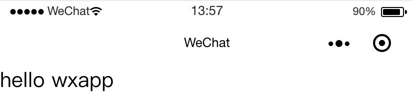

## WXML

> WXML（WeiXin Markup Language）是框架设计的⼀套标签语⾔，结合组件、WXS和事件系统，可以构建出⻚⾯的结构。


### 语法

```xml
<标签 属性名="属性值" 属性名="属性值"></标签>
```


#### Practice

```xml
<view class="m30" data-id="10">
	Hello,World!
    <view>
    	Thanks
    </view>
</view>
```

#### Present


### 特性

#### 数据绑定

##### Pratice

> Mustache方式

```xml
<!-- index.wxml -->
<view>
    <text>{{msg}}</text>
</view>
```

```javascript
// index.js
Page({
    data: {
        msg: "hello wxapp"
    }
})
```


##### Present



##### 属性绑定

```xml
<view>
	<text data-name="{{autherName}}"></text>
</view>
```

```javascript
Page({
    data: {
        autherName: "xiaocc"
    }
})
```


##### 运算符绑定

```xml
<view hidden="{{flag ? true : false}}">
	Hidden
</view>
```

```javascript
Page({
    data: {
        flag: false
    }
})
```

##### 字符串运算绑定、组合式绑定、扩展运算符绑定

#### 标签共同属性

| 属性名         | 类型         | 描述           | 注解                                 |
| -------------- | ------------ | -------------- | ------------------------------------ |
| id             | String       | 组件的唯一标识 | 保持整个页面唯一                     |
| class          | String       | 组件的样式表   | 在对应的wxss中定义的样式表           |
| style          | String       | 组件的内联样式 | 可以动态设置的内联样式               |
| hidden         | Boolean      | 组件是否显示   | 所有组件默认显示                     |
| data-*         | Any          | 自定义属性     | 组件上触发事件时，会发给事件处理函数 |
| `bind*/catch*` | EventHandler | 组件的事件     |                                      |


#### 列表渲染

#### 条件渲染

#### 模板引用